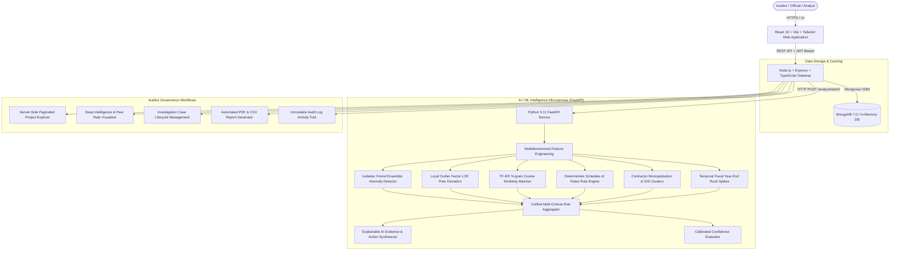
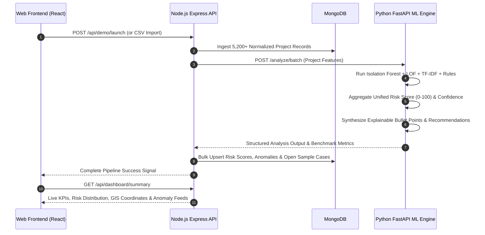

# System Architecture — MPLAD Insight
**AI-Powered Anomaly & Efficiency Intelligence Platform (SIH 2026 - PS26102)**
*Ministry of Statistics and Programme Implementation (MoSPI)*

---

## 1. High-Level Architecture

---

## 2. Intelligence Pipeline Sequence Flow

---

## 3. Core Component Layers

1. **Presentation Layer (`apps/web`):**
   - React 18 with TypeScript, Vite bundler, Tailwind CSS, Lucide icons, Recharts, and React Leaflet.
   - Executive dark-slate government workstation theme designed for dense analytic readability.
   - 1-Click Demo role switchers (`ADMIN`, `AUDITOR`, `ANALYST`, `VIEWER`).

2. **API Gateway Layer (`apps/api`):**
   - Express.js with TypeScript and Mongoose.
   - Automatic fallback to embedded `mongodb-memory-server` if external MongoDB is unavailable.
   - Robust JWT RBAC authorization, Zod schema validation, Helmet security headers, rate limiting, and Winston logging.
   - Native PDFKit generation of official audit reports.

3. **Machine Learning Microservice (`ml-service`):**
   - FastAPI with Python 3.11, scikit-learn, pandas, and numpy.
   - Hybrid ensemble combining unsupervised anomaly detection with transparent statutory domain heuristics.

4. **Synthetic Data Engine (`apps/api/src/seed`):**
   - Deterministic generation of 5,200+ projects across 12 Indian states and 40+ districts with calibrated ground truth anomaly clusters for repeatable 30-second demonstrations.
